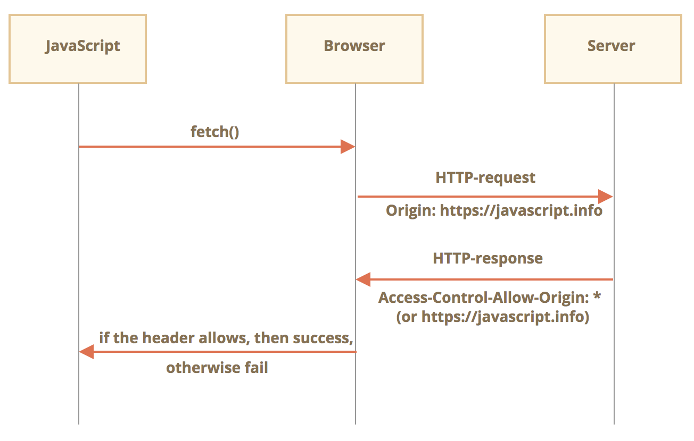
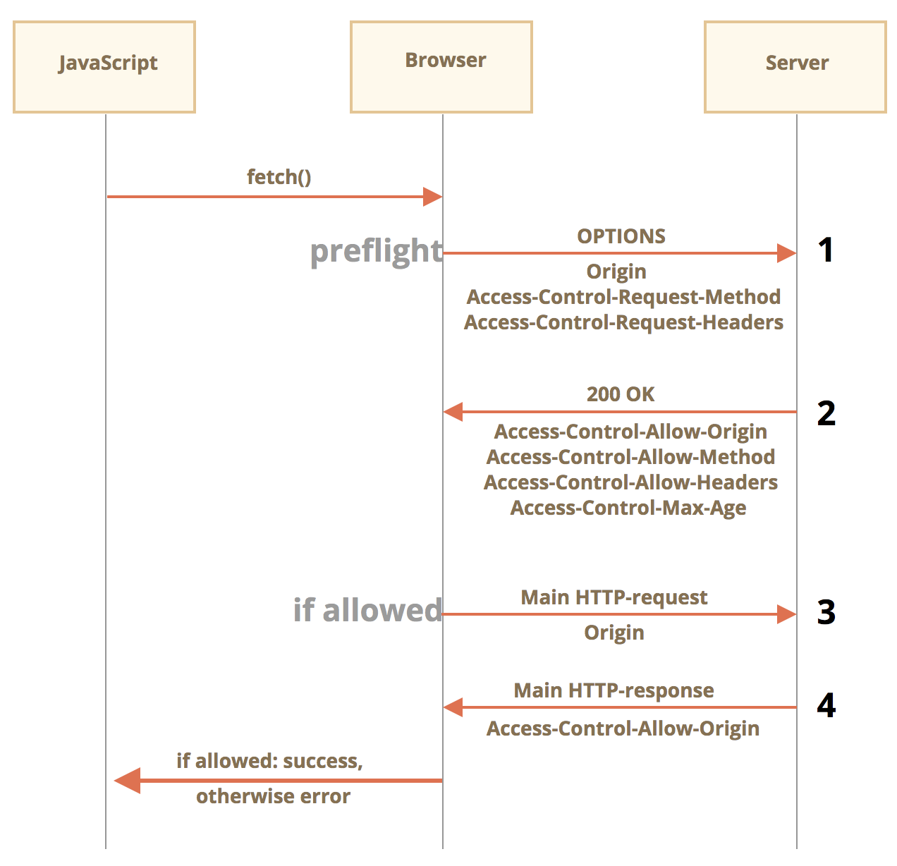

# ajax

nodemon : can automatically restart node when alter code 

```
npm install -g nodemon
nodemon [your node app]
```

## AJAX請求

AJAX即"Asynchronous Javascript And XML"（異步JavaScript和XML）

- ajax是一種瀏覽器通過向服務器發起異步請求，最大優勢是無需更新頁面獲取數據。

- ajax not a programming language, but a combination of currently have techniques using in new ways

- Ex:數據驗證、搜索欄

XML可延伸標記式語言（Extensible Markup Language）是一種標記式語言。is designed for data transfering and storage. different from HTML, XML did not have pre-defined tag (like `<div>` in HTML)

AJAX

- Good: 
  - no need to refresh page to get data from server
  - Allowed coder to update part of page content with user-self-defined event
- Bad:
  - No browsing history, cannot backward
  - 同源政策 (Same-Origin Policy)
  - not friendly to SEO

Ajax請求

1. 瀏覽器地址欄沒有變化
2. 原來頁面中也沒有變化，只是Ajax請求的異步性：不會等待服務器其他請求的執行，每個ajax請求都是單獨一個子任務，任務之間不會相互影響。

### cors

[[Day 27] Cross-Origin Resource Sharing (CORS)](https://ithelp.ithome.com.tw/articles/10251693)

[Fetch：跨源请求](https://zh.javascript.info/fetch-crossorigin)

[輕鬆理解 Ajax 與跨來源請求](https://blog.techbridge.cc/2017/05/20/api-ajax-cors-and-jsonp/)

考量到安全問題，來自一個網站的腳本無法訪問另一個網站的內容。

Cross-Origin 的定義

簡單來說，只要兩個網址的 Schema(`http!==https`)、Host、Port 皆相同就是 Same-origin，否則就是 Cross-origin。

CORS 分為簡單請求（Simple requests）和預檢請求（Preflighted requests）兩種，基本上能不能成功進行 CORS 都是看後端setting，前端只能看著錯誤訊息請後端趕快修正。

> 必要條件(只要跨域request, server都要設置)

發出 CORS Request 時瀏覽器會自動在 Request header 加上目前的 Origin，後端必須在 Response header 中加上相符的 `Access-Control-Allow-Origin` 才能完成 CORS：

```
Access-Control-Allow-Origin: *                   # allow all 
Access-Control-Allow-Origin: http://example.com  # 只允許 http://example.com
```

#### 1. 簡單請求

如果 Request method 是`GET`、`HEAD`、`POST` 其一，且 Request header 的 `Content-Type` 是以下其中一種就是簡單請求，後端不需再做額外設定。

對於跨源請求，默認情況下，JavaScript 只能訪問“簡單” response header：

訪問任何其他 response header 都將導致 error。

- application/x-www-form-urlencoded
- multipart/form-data
- text/plain



#### 2. 預檢請求

瀏覽器的 CORS 機制，還是會幫你發送 Request，但只是 Response 被瀏覽器擋住而已。

如果有 Preflight Request 的話，在發送出去收到結果的時候，就會知道這個 API 並沒有提供 CORS，因此真的 DELETE 請求就不會送出，到這邊就結束了。先用一個 OPTIONS 的請求去確認之後的 Request 能不能送出，這就是 Preflight Request 的目的。

只要不符合簡單請求的規則例如使用了 `PUT`、`DELETE` 等 Method 或者 `Content-Type` 是 `application/json`，在送出該 Request 之前，瀏覽器會先進行一次預檢（Preflight），和簡單請求不同的是如果沒有通過預檢，就不會發送 Request。

> 預檢

發送預檢請求時瀏覽器會先以 `OPTIONS` method 問候一下後端：「我的 Origin 是 `http:example.com`，我想要使用 `PUT` method，另外還想帶上些客製化的 Header。」

```
OPTIONS /data HTTP/1.1
Origin: http://example.com
Access-Control-Request-Method: PUT
Access-Control-Request-Headers: X-Custom-Header
```

後端收到 Request 後，可以任意決定要放行的設定：

```
Access-Control-Allow-Origin: *
Access-Control-Allow-Methods: PUT, POST, GET, DELETE, OPTIONS
Access-Control-Allow-Headers: X-Custom-Header
Access-Control-Max-Age: 86400
```

只要 Request header 的 `Origin` 和 `Access-Control-Request-` 系列都在 Response header 的列表中，瀏覽器就會發出正式的 Reqeust，注意正式的 Response 依然要有符合的 Headers 才能完成 CORS。

至於 `Access-Contorl-Max-Age` 則是告訴瀏覽器幾秒之內不用再次預檢，以 `86400` 來說，就是完成一次預檢後有一天的效力。




預檢請求使用 OPTIONS 方法，它沒有 body，但是有兩個 header：

- Access-Control-Request-Method header 帶有非簡單請求的方法。
- Access-Control-Request-Headers header 提供一個以逗號分隔的非簡單 HTTP-header 列表。

如果服務器同意處理請求，那麼它會進行響應，此響應的狀態碼應該為 200，沒有 body，具有 header：

- Access-Control-Allow-Origin 必須為 * 或進行請求的源（例如 https://javascript.info）才能允許此請求。
- Access-Control-Allow-Methods 必須具有允許的方法。
- Access-Control-Allow-Headers 必須具有一個允許的 header 列表。
- 另外，header Access-Control-Max-Age 可以指定緩存此權限的秒數。因此，瀏覽器不是必須為滿足給定權限的後續請求發送預檢。

#### Credentials

預設 CORS Request 都是匿名（Anonymous）發送，因此想要帶上 Cookies 或是收到 Cookies 需要在前後端都加入一點設定。

前端以 Fetch 為例，無論是簡單還是預檢請求，加上一個設定值後瀏覽器在發出 CORS Request 時就會帶上 Cookies，同時 Response header 中的 `Set-Cookie` 才會生效：

```javascript
// Frontend
fetch('https://example.com', { credentials: 'include' })
```

後端除了要滿足前面提及的 CORS policy 之外，還需要多加一條 Response header `Access-Control-Allow-Credentials`，否則瀏覽器在收到 Response 時就會直接忽略掉，同時 `Set-Cookie` header 也不會生效，另外 `Access-Control-Allow-Origin` **不能是 Wildcard**（`*`），需要和 Request 的 Origin 相同：

```
Access-Control-Allow-Origin: *
Access-Control-Allow-Credentials: true
```

在簡單請求的狀況下，收到正確 Response 後一切都會正常運作；在預檢請求的情況下，只有正式 Response 中的 `Set-Cookie` 才會生效。

> Cross-Origin !== Cross-Site

做完以上準備後只是告知瀏覽器要傳送和接收 Cookies，但最終的是否實行還是會遵守 Cookie 的 `SameSite` 屬性，是否為 Cross-site 的判定方式在 [Cookies - SameSite Attribute](https://ithelp.ithome.com.tw/articles/10251288) 中有詳細解釋。

### Referer

有一個 HTTP-header Referer，它通常包含發起網絡請求的頁面的 url。

例如，當從 http://javascript.info/some/url fetch http://google.com 時，header 看起來如下：

```
Accept: */*
Accept-Charset: utf-8
Accept-Encoding: gzip,deflate,sdch
Connection: keep-alive
Host: google.com
Origin: http://javascript.info
Referer: http://javascript.info/some/url
```

- 我們需要 Origin，是因為有時會沒有 Referer。例如，當我們從 HTTPS（從高安全性訪問低安全性）fetch HTTP 頁面時，便沒有 Referer。 

- 內容安全策略 可能會禁止發送 Referer。 fetch 也具有阻止發送 Referer 的選項，甚至允許修改它（在同一網站內）。 
- 根據規範，Referer 是一個可選的 HTTP-header。 正是因為 Referer 不可靠，才發明了 Origin。瀏覽器保證跨源請求的正確 Origin。


### test

GET

`response.setHeader('Access-Control-Allow-Origin', '*');`

```html
General
  Request URL: http://127.0.0.1:8000/server?a=100&b=200&C=300
  Request Method: GET
  Status Code: 200 OK
  Remote Address: 127.0.0.1:8000
  Referrer Policy: strict-origin-when-cross-origin

Response Header
  Access-Control-Allow-Origin: *
  Content-Length: 22
  Content-Type: text/html; charset=utf-8
  Date: Fri, 23 Jul 2021 03:51:22 GMT
  ETag: W/"16-VPwaxRZsjvhK/WkkkKa6jeOlokQ"
  X-Powered-By: Express

Request Header
  Accept: */*
  Accept-Encoding: gzip, deflate, br
  Accept-Language: zh-TW,zh;q=0.9,en-US;q=0.8,en;q=0.7
  Connection: keep-alive
  Host: 127.0.0.1:8000
  If-None-Match: W/"16-VPwaxRZsjvhK/WkkkKa6jeOlokQ"
  Origin: http://127.0.0.1:5500
  Referer: http://127.0.0.1:5500/
  sec-ch-ua: " Not;A Brand";v="99", "Google Chrome";v="91", "Chromium";v="91"
  sec-ch-ua-mobile: ?0
  Sec-Fetch-Dest: empty
  Sec-Fetch-Mode: cors
  Sec-Fetch-Site: same-site
  User-Agent: Mozilla/5.0 (Macintosh; Intel Mac OS X 10_13_4) AppleWebKit/537.36 (KHTML, like Gecko) Chrome/91.0.4472.114 Safari/537.36

Query String Params
  a: 100
  b: 200
  C: 300
```

POST

`response.setHeader('Access-Control-Allow-Origin', '*');`

自定義response header --> need `response.setHeader('Access-Control-Allow-Headers', '*'); at server`

```
General
  Request URL: http://127.0.0.1:8000/server
  Request Method: POST
  Status Code: 200 OK
  Remote Address: 127.0.0.1:8000
  Referrer Policy: strict-origin-when-cross-origin
  
Response Header
	Access-Control-Allow-Headers: *
  Access-Control-Allow-Origin: *
  Connection: keep-alive
  Content-Length: 15
  Content-Type: text/html; charset=utf-8
  Date: Fri, 23 Jul 2021 07:05:25 GMT
  ETag: W/"f-mWSLyqUHRxJrAT3TkIZCIj1OUFI"
  X-Powered-By: Express

Request Header
  Accept: */*
  Accept-Encoding: gzip, deflate, br
  Accept-Language: zh-TW,zh;q=0.9,en-US;q=0.8,en;q=0.7
  Connection: keep-alive
  Content-Length: 17
  Content-Type: application/x-www-form-urlencoded
  Host: 127.0.0.1:8000
  name: snoppy		<--自定義response header --> need response.setHeader('Access-Control-Allow-Headers', '*'); at server
  Origin: http://127.0.0.1:5500
  Referer: http://127.0.0.1:5500/
  sec-ch-ua: " Not;A Brand";v="99", "Google Chrome";v="91", "Chromium";v="91"
  sec-ch-ua-mobile: ?0
  Sec-Fetch-Dest: empty
  Sec-Fetch-Mode: cors
  Sec-Fetch-Site: same-site
  User-Agent: Mozilla/5.0 (Macintosh; Intel Mac OS X 10_13_4) AppleWebKit/537.36 (KHTML, like Gecko) Chrome/91.0.4472.114 Safari/537.36

Form Data
	a: 100
  b: 200
  c: 300
```

### json

Server

```js
app.all('/json-server', (request, response) => {
    //設置response header 設置允許跨域
    response.setHeader('Access-Control-Allow-Origin', '*');
    //遇到自定義response header時可以設置
    response.setHeader('Access-Control-Allow-Headers', '*');
    //響應一個數據
    const data = {
        name: 'snoppy'
    };
    //對Object進行字符串轉化
    let str = JSON.stringify(data);
    //設置response body
    // response.send("HELLO AJAX JSON");
    response.send(str);
});
```

JSON.html

1. 手動對數據進行一個轉換

```js
window.onclick = function () {
  // console.log('test');
  //發送請求
  const xhr = new XMLHttpRequest();
  //初始化
  xhr.open('GET','http://127.0.0.1:8000/json-server')
  //發送、
  xhr.send();
  //事件綁定
  xhr.onreadystatechange = function () {
    //判斷
    if (xhr.readyState === 4) {
      if (xhr.status >= 200 && xhr.status < 300) {
        // 1. 手動對數據進行一個轉換
        let data = JSON.parse(xhr.response);
        console.log(data);
        result.innerHTML = data.name;
      }
    }
  }
}
```

2. 自動轉換:直接設置ajax響應數據類型

```js
window.onclick = function () {
  // console.log('test');
  //發送請求
  const xhr = new XMLHttpRequest();
  // 1. 設置  response body的數據類型
  xhr.responseType = 'json';
  //初始化
  xhr.open('GET','http://127.0.0.1:8000/json-server')
  //發送、
  xhr.send();
  //事件綁定
  xhr.onreadystatechange = function () {
    //判斷
    if (xhr.readyState === 4) {
      if (xhr.status >= 200 && xhr.status < 300) {
        // 2. 自動轉換:直接設置ajax響應數據類型
        console.log(xhr.response);
        result.innerHTML = xhr.response.name;
      }
    }
  }
}
```

### Time-limit exceed

```js
btn.addEventListener('click', function () {
  const xhr = new XMLHttpRequest();
  //超時設置 2s 設置(2s內服務端不response，cancel 請求)
  xhr.timeout = 2000;
  //超時回調
  xhr.ontimeout = function () {
    alert('request out of time, try again!!');

  }
  //網絡異常回調
  xhr.onerror = function () {
    alert('network connecting problem！');
  }
  xhr.open('GET', 'http://127.0.0.1:8000/delay');
  xhr.send();
  xhr.onreadystatechange = function () {
    if (xhr.readyState === 4) {
      if (xhr.status >= 200 && xhr.status < 300) {
        result.innerHTML = xhr.response;
      }
    }
  }
})
```

### Repeat request

判斷標識變量

```js
//標識變量
let isSending = false;// 是否正在發送AJAX請求

btns[0].onclick = function () {
  //判斷標識變量
  if (isSending) x.abort();//如果該請求正在發送，則取消該請求，創建一個新的請求

  x = new XMLHttpRequest();
  //修改 標識變量的值
  isSending = true;
  x.open('GET', 'http://127.0.0.1:8000/delay');
  x.send();
  x.onreadystatechange = function () {
    if (x.readyState === 4) {
      //修改標識變量
      //這裡不用判斷response狀態碼，因為這個請求可能是失敗的請求
      isSending = false;
    }
  }
}
```


### JSONP to free cors

Server.js

```js
app.all('/jsonp-server', (request, response) =>{
    // response.send('HELLO JSONP-server');
    // script標籤最好還是返回js代碼，要的是一段函數的調用
    // response.send('console.log("hello jsonp")');
    const data = {
        name: 'jsonp'
    };
    //將數據轉化為字符串
    let str = JSON.stringify(data);
    //返回結果形式 是一個函數調用，而函數的實參就是我們想給客戶端返回的結果數據
    response.end(`handle(${str})`);
});
```


```html
<div id="result"></div>
<script>
  //處理數據
  function handle(data) {
    //獲取 result 元素
    const result = document.getElementById('result');
    result.innerHTML = data.name;
  }
</script>
<!-- <script src="./app.js"></script> -->
<!-- <script src="http://127.0.0.1:5500/%E4%BB%A3%E7%A0%81/7-AJAX%E8%B7%A8%E5%9F%9F%E9%97%AE%E9%A2%98/2-JSONP/js/app.js"></script> -->
<script src="http://127.0.0.1:8000/jsonp-server"></script>
```

